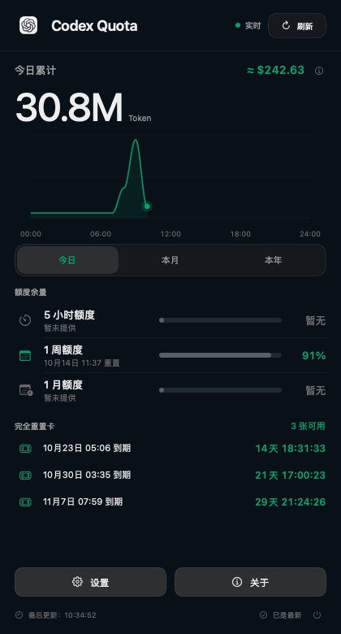
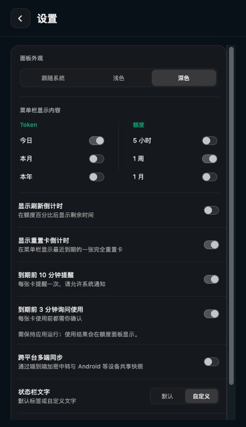
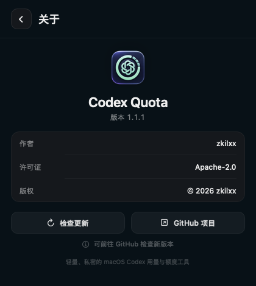

# Codex Quota

<p align="center"><strong>简体中文</strong> · <a href="README_EN.md">English</a></p>

<p align="center">
  
</p>

<h3 align="center">把 Codex 用量、额度和刷新时间留在 macOS 菜单栏</h3>

<p align="center">
  macOS 14+ · SwiftUI · v1.1.1 · Apache-2.0
</p>

<p align="center">
  
</p>

Codex Quota 是一款轻量、原生的 macOS 菜单栏工具。它通过本机 Codex 服务读取已登录账号的额度与 Token 用量，以半透明毛玻璃面板展示实时数据，不需要额外登录。默认情况下数据只在本机处理；实验性的跨平台同步只上传端到端加密后的配额快照，不上传账号凭据或会话内容。

## 1.1.1 更新

- 默认在每张重置卡到期前 10 分钟提醒一次，最后 3 分钟弹窗询问是否使用；两个开关可分别关闭。
- 必须点击“确认使用”才会消耗这张卡；拒绝、关闭、未回应或卡片过期均不会使用，也不会反复询问。
- 确认后重新核验同一卡片，重试沿用同一请求标识；使用结果显示在面板与菜单栏提示中。
- 重置卡的菜单栏标签支持自定义，留空时只显示倒计时。
- 防止较早的常规刷新覆盖重置卡使用后更新的额度状态。

## 1.1.0 更新

- 新增完全重置卡到期列表、每秒倒计时与 24 小时内到期提醒。
- 可在菜单栏显示最近到期重置卡的倒计时，默认关闭。
- 兼容 Codex 桌面版新旧内置 CLI 路径，以及用户目录和 PATH 中的 Codex CLI。
- 修复启动时出现空白窗口的问题；面板可滚动并适应屏幕可用高度。
- 改进服务端与本地 Token 用量合并，避免统计追上后重复计数。
- 新增实验性跨平台加密快照同步，以及可自托管的 Node relay；不包含 Android 客户端或托管服务。

## 1.0.1 亮点

- 全新设计的半透明毛玻璃主面板，支持跟随系统、浅色和深色外观。
- 今日、本月、本年 Token 数据可视化：今日按小时、本月按天、本年按月展示分时用量，而不是单调的累计曲线。
- 曲线支持平滑绘制动画、悬停取值和与时间轴严格对齐的交互点。
- 今日实时 Token 增量会同步合并到本月和本年统计。
- Token 总量旁显示美元模拟换算，便于快速理解使用规模。
- 设置页可独立控制菜单栏中的 Token、额度窗口、刷新倒计时与自定义标签。
- 新增关于页、GitHub 版本检查和项目入口。
- 项目许可证由 MIT 调整为 Apache License 2.0。

## 界面

<table>
  <tr>
    <td align="center"><strong>显示与外观设置</strong></td>
    <td align="center"><strong>关于与版本检查</strong></td>
  </tr>
  <tr>
    <td></td>
    <td></td>
  </tr>
</table>

## 功能

### Token 用量

- 显示今日、本月和本年 Token 总量。
- 今日曲线按小时聚合，本月曲线按日聚合，本年曲线按月聚合。
- 鼠标悬停曲线即可查看对应时间段的 Token 数值。
- 本地会话产生的新 Token 会实时补入今日、本月和本年数据。
- 内置紧凑格式，自动使用 `K`、`M`、`B` 展示大数值。

### 额度与刷新

- 展示 Codex 返回的 5 小时、1 周和 1 月额度窗口。
- 同时显示剩余百分比、进度条和精确重置时间。
- 启动时自动同步，此后每 60 秒刷新一次。
- 支持手动刷新，并明确显示同步中、已更新和异常状态。

### 完全重置卡倒计时

- 自动读取可用重置卡，按到期时间由近到远排列。
- 显示本地时区的到期日期与时间，以及每秒更新的剩余天数和时分秒。
- 24 小时内到期的卡用橙色标示，到期后自动从可用列表移除。
- 未提供明细时保留可用数量并显示提示，面板支持滚动查看更多卡。
- 设置中可开启“显示重置卡倒计时”，在菜单栏显示最近到期的一张可用卡；默认关闭，到期后自动切换下一张。
- 默认在到期前 10 分钟提醒一次，在最后 3 分钟询问是否使用即将到期的卡；每张卡都需你确认后才会使用。两个功能可分别关闭，独立于菜单栏显示开关。
- 请允许系统通知并保持应用运行。确认使用后会重新核验卡片，超时重试沿用同一请求标识；成功或失败会在面板显示。未经你确认不会使用卡片，后台未确认成功时不会显示已使用。

### 菜单栏与外观

- 可选择在菜单栏显示今日、本月、本年 Token。
- 可独立显示或隐藏不同额度窗口和刷新倒计时。
- 支持默认标签与自定义应用前缀、Token 标签、额度标签和重置卡标签；留空标签时只显示数值。
- 支持跟随系统、浅色和深色三种外观。
- 原生高斯模糊结合 80% 自适应主色层，在保持可读性的同时保留桌面通透感。
- 页面、分段选择器和曲线切换使用平滑动画，面板始终锚定菜单栏图标。

### 关于与更新

- 关于页提供作者、版本、版权和许可证信息。
- “检查更新”会连接 GitHub Releases 判断是否存在新版本。
- 当前版本不会自动下载安装更新；发现新版后会打开对应的 GitHub Release 页面。

## 数据如何工作

Codex Quota 在本机合并两类只读数据：

1. `codex app-server --stdio`：读取账号额度、重置时间和服务端 Token 汇总。
2. `~/.codex/sessions` 与 `~/.codex/archived_sessions`：读取当天会话中的 `token_count` 事件，补足服务端统计延迟并生成小时曲线。

服务端当天统计尚未刷新时，应用会补齐本地已发生的当天用量，并同步反映到本月和本年总量；服务端统计追上后不会重复累加。应用不读取账号密码，不保存认证令牌，不上传提示词或会话内容。

## 实验性跨平台同步

设置中可以启用跨平台同步，并填写自托管同步服务地址。应用会生成一段 256 位随机同步码，保存在 macOS 钥匙串中；同一同步码可供 Android 或其他客户端使用。

- 快照在客户端使用 AES-256-GCM 加密后上传。
- 中转服务只保存密文、更新时间和随机设备 ID。
- 配额快照采用“较新更新时间胜出”，不会把多个设备的账号级 Token 总量相加，避免重复计数。
- 远端地址必须使用 HTTPS；只有本机调试允许 `http://127.0.0.1`。
- 可自托管的无依赖 Node relay 和 Android 协议说明位于 [`relay/`](relay/README.md)。

这是一次协议验证实现，不包含托管服务或现成 Android 客户端。同步码等同于该加密记录的访问权，应通过可信渠道传递。

## 系统要求

- macOS 14 Sonoma 或更高版本。
- 已安装 Codex 桌面版（兼容 `ChatGPT.app`、`Codex.app` 的新旧内置 CLI 路径），或提供可执行的 Codex CLI。应用也会查找用户的 `Applications` 目录、常见 CLI 安装位置和 `PATH`。
- 从源码构建时需要 Swift 6 工具链。

## 安装

1. 前往 [GitHub Releases](https://github.com/zkilxx/Codex-Quota/releases) 下载最新的 `Codex-Quota-*.dmg`。
2. 打开 DMG，将 **Codex Quota** 拖入“应用程序”文件夹。
3. 启动应用。Codex Quota 不显示 Dock 图标，所有操作都在菜单栏中完成。

如果 macOS 首次阻止打开，请前往“系统设置 → 隐私与安全性”，确认允许启动该应用。

## 从源码构建

```bash
git clone https://github.com/zkilxx/Codex-Quota.git
cd Codex-Quota
./script/build_and_run.sh --verify
```

构建脚本会停止旧实例、使用 SwiftPM 编译、生成 `dist/CodexQuota.app`，然后启动并检查进程。

可选模式：

- `./script/build_and_run.sh --debug`：使用 LLDB 启动。
- `./script/build_and_run.sh --logs`：启动并查看进程日志。
- `./script/build_and_run.sh --telemetry`：查看应用统一日志。
- `./script/build_and_run.sh --verify`：启动并验证进程存在。
- `./script/build_and_run.sh --release`：生成经过优化的发布版应用包。

## 美元金额说明

界面中的美元金额是模拟换算，不是账单或实际扣费。1.1.1 使用每 100 万 Token `$7.875` 的固定混合估算系数；由于本机接口不区分输入、缓存输入和输出 Token，实际费用会随模型、缓存比例、输入输出结构和套餐规则变化。

## 隐私

- 默认情况下数据处理全部在本机完成。
- 不需要在应用内登录。
- 不保存或上传 Codex 认证信息。
- 不上传会话内容或 Token 事件。
- 只有用户主动启用跨平台同步时，才会把加密后的额度、Token 汇总和图表快照发送到用户配置的中转服务。
- 仅在用户点击“检查更新”时访问 GitHub。

## 许可证

Copyright 2026 zkilxx。

本项目依据 [Apache License 2.0](LICENSE) 开源，版权与归属声明见 [NOTICE](NOTICE)。
