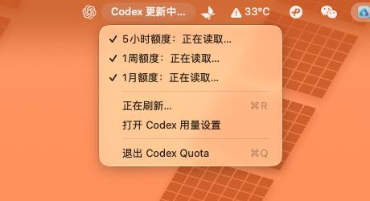

# Codex Quota

<p align="center"><a href="README.md">简体中文</a> · <strong>English</strong></p>

<p align="center">
  
</p>

<p align="center">
  
</p>

A lightweight macOS menu bar utility that shows your remaining Codex quota and the time until it resets—at a glance.

## Features

- Persistent menu bar status, such as `Codex 74% · 6d`
- Fetches quota data at launch and refreshes automatically every 60 seconds
- Shows the exact reset time for each available quota window
- Lets you toggle 5-hour, 1-week, and 1-month quota windows directly from the app menu
- Supports manual refresh and quick access to Codex usage settings
- Reads the signed-in account through the local Codex app server without storing or uploading authentication tokens

## Screenshot

The screenshot above shows the app running with its complete menu open. The status text is rendered with the native macOS `NSStatusItem` API, so the remaining quota and reset countdown stay visible without opening the menu.

## Requirements

- macOS 14 or later
- Codex Desktop installed and signed in, or a working local `codex` executable
- Swift 6 toolchain for development builds

## Installation

1. Download the latest `Codex-Quota-*.dmg` from [GitHub Releases](https://github.com/zkilxx/Codex-Quota/releases).
2. Open the DMG and drag **Codex Quota** into the Applications folder.
3. Launch Codex Quota from Applications. Your quota and reset time will appear in the menu bar.

If macOS blocks the app the first time you open it, allow it from **System Settings → Privacy & Security**.

## Development

```bash
swift build
./script/build_and_run.sh --verify
```

Optional launch modes:

- `--debug`: launch with LLDB
- `--logs`: launch and stream application logs
- `--telemetry`: stream the app's unified logging subsystem
- `--verify`: launch and verify that the process is running

## Data Source and Privacy

Codex Quota calls the local `codex app-server --stdio` process and reads the `account/rateLimits/read` response. Authentication remains managed by the local Codex installation. The app only reads quota snapshots and does not read, store, or transmit account credentials.

## License

MIT
