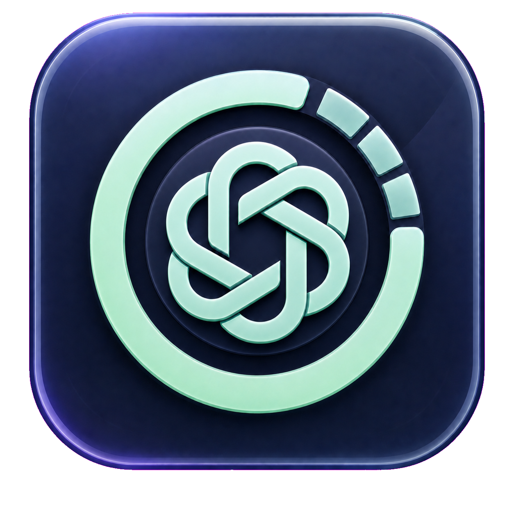
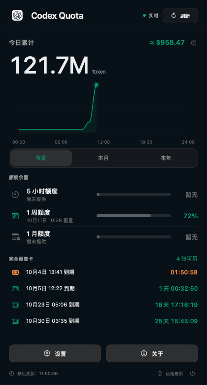
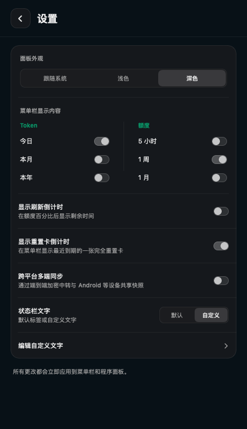
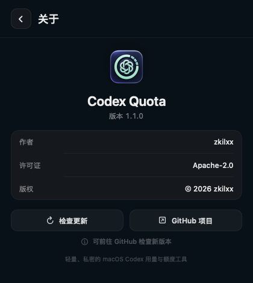

# Codex Quota

<p align="center"><a href="README.md">简体中文</a> · <strong>English</strong></p>

<p align="center">
  
</p>

<h3 align="center">Keep Codex usage, quota, and reset times in the macOS menu bar</h3>

<p align="center">
  macOS 14+ · SwiftUI · v1.1.0 · Apache-2.0
</p>

<p align="center">
  
</p>

Codex Quota is a lightweight native macOS menu bar utility. It reads quota and token usage from the locally signed-in Codex service and presents live data in a translucent frosted-glass panel. No additional sign-in is required. Data stays local by default; experimental cross-platform sync uploads only end-to-end encrypted quota snapshots, never account credentials or conversation content.

## What's new in 1.1.0

- Full reset-credit expiry lists, second-by-second countdowns, and warnings for credits expiring within 24 hours.
- An optional menu bar countdown for the next expiring reset credit, disabled by default.
- Codex discovery supports old and new desktop CLI paths, user Applications folders, and PATH installations.
- Fixes the blank window at launch; panels scroll and fit the available screen height.
- Improves server/local token reconciliation to avoid double counting when server totals catch up.
- Experimental encrypted cross-platform snapshot sync with a self-hostable Node relay; no hosted service or Android app is included.

## What's new in 1.0.1

- A completely redesigned frosted-glass panel with System, Light, and Dark appearances.
- Daily, monthly, and yearly token visualization: hourly buckets for Today, daily buckets for This Month, and monthly buckets for This Year instead of a monotonically cumulative curve.
- Smooth chart drawing, hover inspection, and interaction points aligned precisely with the time axis.
- Live tokens from today are merged into monthly and yearly totals immediately.
- An estimated USD amount next to the selected token total.
- A dedicated Settings page for menu bar metrics, quota windows, reset countdowns, and custom labels.
- A new About page with GitHub release checking and repository access.
- Licensing migrated from MIT to Apache License 2.0.

## Interface

<table>
  <tr>
    <td align="center"><strong>Display and appearance settings</strong></td>
    <td align="center"><strong>About and update check</strong></td>
  </tr>
  <tr>
    <td></td>
    <td></td>
  </tr>
</table>

## Features

### Token usage

- Shows token totals for Today, This Month, and This Year.
- Aggregates the Today chart by hour, the monthly chart by day, and the yearly chart by month.
- Hover over a chart to inspect the token count for an individual time bucket.
- New local-session tokens are reflected in daily, monthly, and yearly values in near real time.
- Compact `K`, `M`, and `B` formatting keeps large totals readable.

### Quota and refresh

- Displays the 5-hour, 1-week, and 1-month quota windows returned by Codex.
- Shows the remaining percentage, a progress bar, and the exact reset time.
- Syncs at launch and refreshes automatically every 60 seconds.
- Supports manual refresh with clear syncing, success, and error states.

### Full reset credit countdowns

- Reads available reset credits automatically and sorts them by expiration time.
- Shows local expiration dates and times, with remaining days and an hours/minutes/seconds countdown updated every second.
- Highlights credits expiring within 24 hours in orange and removes expired credits from the available list.
- Preserves the available count when details are unavailable and supports scrolling through additional credits.
- Enable “Show reset credit countdown” in Settings to show the earliest-expiring available credit in the menu bar. This is off by default and switches to the next available credit on expiration.

### Menu bar and appearance

- Optionally show daily, monthly, and yearly token totals in the menu bar.
- Independently show or hide quota windows and reset countdowns.
- Use default labels or customize the app prefix, token labels, and quota labels.
- Choose System, Light, or Dark appearance.
- Native Gaussian blur and an adaptive 80% color layer keep the panel readable while preserving desktop translucency.
- Smooth page, segmented-control, and chart transitions keep the popover anchored to its menu bar item.

### About and updates

- The About page includes author, version, copyright, and license information.
- Check Update connects to GitHub Releases and compares the latest tag with the installed version.
- Updates are not downloaded or installed automatically. When a newer version is found, the app opens its GitHub Release page.

## How the data works

Codex Quota merges two read-only local sources:

1. `codex app-server --stdio` provides account quota, reset times, and server-side token totals.
2. `~/.codex/sessions` and `~/.codex/archived_sessions` provide today's `token_count` events, compensating for server aggregation delay and powering the hourly chart.

While the server's daily summary is delayed, the app includes usage already recorded locally for today and propagates the correction into the current month and year. Once the server catches up, that usage is not added twice. The app does not read passwords, store authentication tokens, or upload prompts and conversation content.

## Experimental cross-platform sync

Cross-platform sync can be enabled in Settings with a self-hosted relay URL. The app generates a random 256-bit sync code, stores it in the macOS Keychain, and lets Android or other clients use the same code.

- Snapshots are encrypted client-side with AES-256-GCM.
- The relay stores only ciphertext, an update time, and a random device ID.
- Newer snapshots win; account-level token totals are never added across devices, avoiding double counting.
- Remote endpoints must use HTTPS. Plain HTTP is accepted only on loopback for development.
- A dependency-free Node relay and the Android protocol are documented in [`relay/`](relay/README.md).

This branch is a protocol proof of concept. It does not include a hosted relay or a ready-made Android client. Possession of the sync code grants access to the encrypted record, so transfer it through a trusted channel.

## Requirements

- macOS 14 Sonoma or later.
- Codex desktop (supports current and legacy CLI locations inside `ChatGPT.app` and `Codex.app`), or an executable Codex CLI. The app also searches the user's `Applications` directory, common CLI installation locations, and `PATH`.
- Swift 6 toolchain when building from source.

## Installation

1. Download the latest `Codex-Quota-*.dmg` from [GitHub Releases](https://github.com/zkilxx/Codex-Quota/releases).
2. Open the DMG and drag **Codex Quota** into Applications.
3. Launch the app. Codex Quota has no Dock icon; all interaction happens in the menu bar.

If macOS blocks the first launch, open **System Settings → Privacy & Security** and allow the application to run.

## Build from source

```bash
git clone https://github.com/zkilxx/Codex-Quota.git
cd Codex-Quota
./script/build_and_run.sh --verify
```

The build script stops the previous instance, compiles with SwiftPM, stages `dist/CodexQuota.app`, launches it, and verifies the process.

Optional modes:

- `./script/build_and_run.sh --debug`: launch with LLDB.
- `./script/build_and_run.sh --logs`: launch and stream process logs.
- `./script/build_and_run.sh --telemetry`: stream the app's unified logs.
- `./script/build_and_run.sh --verify`: launch and verify that the process exists.
- `./script/build_and_run.sh --release`: build an optimized release app bundle.

## About the USD estimate

The USD amount is a simulation, not a bill or an actual charge. Version 1.1.0 uses a fixed blended estimate of `$7.875` per one million tokens. The local interface does not separate input, cached input, and output tokens, so actual cost varies by model, cache ratio, input/output mix, and plan rules.

## Privacy

- All usage processing stays on the Mac by default.
- No in-app account sign-in is required.
- Codex authentication information is neither stored nor uploaded.
- Conversation content and token events are never uploaded.
- Only when cross-platform sync is explicitly enabled are encrypted quota, token-summary, and chart snapshots sent to the user-configured relay.
- GitHub is contacted only when the user clicks Check Update.

## License

Copyright 2026 zkilxx.

Licensed under the [Apache License 2.0](LICENSE). See [NOTICE](NOTICE) for attribution details.
